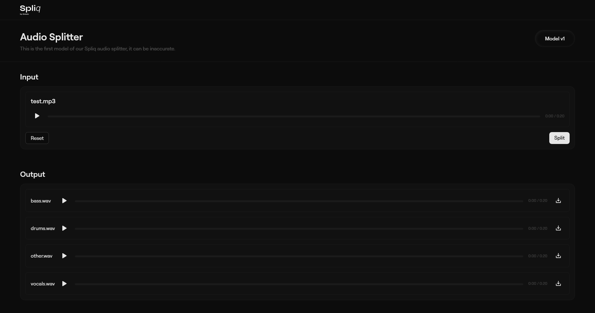

# Spliq – Music Source Separation Platform


**Spliq** is a full-stack web application for seamless music source separation using [Demucs](https://github.com/facebookresearch/demucs). It allows users to split audio tracks into separate stems, such as vocals, drums, bass, guitars, and piano, making it ideal for music enthusiasts, producers, or anyone seeking instrumental or karaoke versions of songs.

> **Note:** Currently, Spliq uses the default *htdemucs* model. Support for additional Demucs models like *htdemucs_ft*, *mdx_extra*, and *mdx_extra_q* is planned, and contributions are welcome.

---

## Features

* **Music Source Separation:** Extract individual audio elements from any track.
* **User-Friendly Interface:** Drag-and-drop upload and instant processing.
* **Downloadable Output:** Receive separated stems in a ZIP file.
* **Modular Architecture:** Backend and frontend are decoupled for easy maintenance.
* **Cross-Platform:** Works on Windows, macOS, and Linux.

---

## Project Structure

```
spliq/
├─ backend/        # Python FastAPI backend for audio processing using Demucs
├─ frontend/       # React-based frontend for user interaction
├─ screenshots/    # Screenshots for README or demo purposes
├─ README.md       # Project documentation
└─ .gitignore      # Git ignore rules
```

* [backend/](https://github.com/NilanshuGarhewal/Spliq-by-Gresic-Audio-Splitter/tree/main/backend) – Handles audio separation and API endpoints.
* [frontend/](https://github.com/NilanshuGarhewal/Spliq-by-Gresic-Audio-Splitter/tree/main/frontend) – User interface built with React.

---

## Getting Started

### Prerequisites

* **Python 3.10+** – for backend audio processing
* **Node.js 18+** – for frontend development
* **npm or Yarn** – for package management
* **Audio files** – MP3, WAV, etc.

### Installation

1. **Clone the repository:**

```bash
git clone https://github.com/NilanshuGarhewal/spliq.git
cd spliq
```

2. **Setup the backend:**

```bash
cd backend
python -m venv env         # Create virtual environment
# Activate the environment
# Linux/macOS:
source env/bin/activate
# Windows:
env\Scripts\activate

pip install -r requirements.txt
```

3. **Setup the frontend:**

```bash
cd ../frontend
npm install       # or yarn install
npm start         # or yarn run dev
```

---

### Usage

1. **Run the backend server:**

```bash
cd backend
uvicorn main:app --reload
```

2. **Launch the frontend:**

```bash
cd frontend
npm start
```

3. Open your browser and upload an audio file.
4. The backend will process and separate the stems.
5. Download the output ZIP file containing all stems.

---

### Demo / Screenshots

**Input & Output Interface:**



---

## Supported Models

| Model       | Description                          |
| ----------- | ------------------------------------ |
| htdemucs    | Default hybrid transformer model     |
| htdemucs_ft | Fine-tuned model, cleaner but slower |
| mdx_extra   | Fast and efficient separation        |
| mdx_extra_q | Super fast, lightweight model        |

> Contributions for adding more models are welcome.

---

## Technologies Used

* **Demucs** – Music source separation
* **Python & FastAPI** – Backend API
* **React & JavaScript** – Frontend interface
* **Node.js & npm/yarn** – Frontend package management
* **ZIP files** – For downloadable separated stems

---

## Contributing

Contributions are welcome! Suggestions include:

* Adding support for additional Demucs models
* Improving frontend UX/UI
* Fixing bugs or improving documentation

**Contribution Steps:**

1. Fork the repository
2. Create a branch (`git checkout -b feature/new-feature`)
3. Make your changes
4. Commit your changes (`git commit -m "Add new feature"`)
5. Push your branch (`git push origin feature/new-feature`)
6. Open a Pull Request

---

## License

This repository currently does not specify a license. Contact the author for usage and contribution guidelines.

---

## Author

**Nilanshu Garhewal** – [GitHub Profile](https://github.com/NilanshuGarhewal)

---

```
Tips:
- Keep images in a `screenshots/` folder and link them relatively.
- Use headings, bold, and italic to improve readability.
- Update usage instructions and URLs when deploying or changing paths.
```
